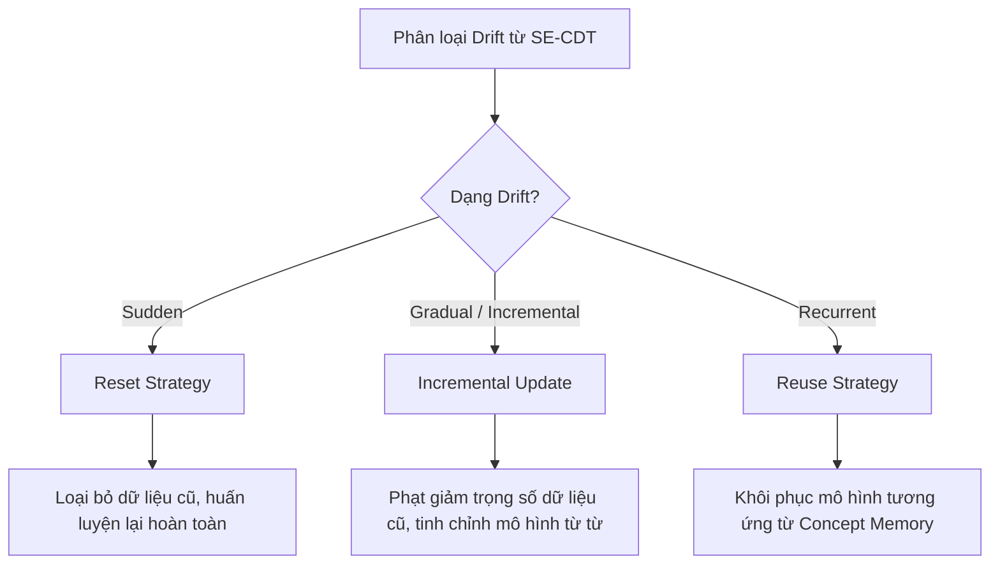

# Hướng Dẫn Toàn Diện Luận Văn & Cẩm Nang Bảo Vệ Thạc Sĩ

**Đề tài:** *Nghiên cứu và phát triển hệ thống tự động phát hiện hiện tượng trôi dạt và cập nhật mô hình học máy thích ứng*  
**Tác giả:** Lê Phúc Đức (MSSV: 2370116)  
**Giảng viên hướng dẫn:** PGS.TS Thoại Nam  
**Đơn vị:** Trường Đại học Bách Khoa — ĐHQG-HCM, Khoa Khoa học và Kỹ thuật Máy tính  

---

## 📌 Cách đọc hướng dẫn này
Tài liệu này được biên soạn dòng-đối-dòng tương đương với tài liệu tiếng Anh `THESIS_GUIDE.md` (dung lượng lớn ~130KB), được viết để phục vụ song song hai mục đích:
1.  **Cho người ngoài ngành:** Giải thích bằng ngôn ngữ đại chúng, trực quan, dễ hiểu về bài toán trôi dạt khái niệm (concept drift) và lý do tại sao đề tài này lại quan trọng trong thực tế.
2.  **Cho tác giả bảo vệ luận văn (Lê Phúc Đức):** Cung cấp các công thức toán học chi tiết, các tham chiếu dòng mã nguồn cụ thể trong thư mục `core/detectors/`, các lập luận khoa học sắc bén (đặc biệt là giải trình về độ chệch bias và mốc neo hình học của IDW-MMD), và bộ **16 câu hỏi phản biện thực tế** kèm theo câu trả lời mẫu bằng tiếng Việt để chuẩn bị tốt nhất trước Hội đồng.

---

## 🗺️ Mục lục
1. [Bài toán: Concept Drift là gì và tại sao nó lại quan trọng?](#1-bai-toan-concept-drift)
2. [Cơ sở toán học (Mathematical Foundations)](#2-co-so-toan-hoc)
3. [Tổng quan các nghiên cứu liên quan & Thuật toán tiền nhiệm](#3-tong-quan-nghien-cuu-lien-quan)
4. [Đóng góp 1 — Module phát hiện của SE-CDT: ShapeDD-IDW](#4-module-phat-hien-shapedd-idw)
5. [Đóng góp 2 — Module phân loại của SE-CDT](#5-module-phan-loai-se-cdt)
6. [Chiến lược thích ứng mô hình (Model Adaptation)](#6-chien-luoc-thich-ung)
7. [Nguyên mẫu hệ thống thời gian thực trên Apache Kafka](#7-kien-truc-he-thong-kafka)
8. [Đánh giá thực nghiệm: Thiết lập, chỉ số & kết quả chi tiết](#8-danh-gia-thuc-nghiem)
9. [Kiểm định thống kê phi tham số (Friedman & Nemenyi)](#9-kiem-dinh-thong-ke)
10. [Hạn chế và nhược điểm thực tế (Honest Limitations)](#10-han-che-thuc-te)
11. [Bản đồ liên kết mã nguồn (Implementation Map)](#11-ban-do-ma-nguon)
12. [Bộ 16 câu hỏi phản biện thường gặp & Kịch bản trả lời xuất sắc](#12-bo-cau-hoi-phan-bien)

---

# 1. Bài toán: Concept Drift là gì và tại sao nó lại quan trọng?

## 1.1 Tóm tắt trong một đoạn văn
Một mô hình học máy (Machine Learning - ML) được huấn luyện trên dữ liệu lịch sử và sau đó được triển khai để đưa ra dự đoán trên dữ liệu mới trong thực tế. **Trôi dạt khái niệm (Concept Drift)** là hiện tượng mối quan hệ thống kê giữa các đặc trưng đầu vào và nhãn dự đoán thay đổi theo thời gian. Khi xảy ra drift, mô hình sẽ bị sai lệch một cách âm thầm (silent degradation): độ chính xác giảm mạnh nhưng hệ thống không có cảnh báo lỗi kỹ thuật nào. Luận văn này xây dựng một hệ thống tích hợp tự động hoàn toàn: (i) **phát hiện** khi nào xảy ra drift, (ii) **phân loại** hình thái trôi dạt, và (iii) **cập nhật** mô hình bằng chiến lược thích nghi tối ưu, tất cả đều được thực hiện **không giám sát (unsupervised)** mà không cần nhãn dữ liệu thực tế tại thời điểm vận hành.

## 1.2 Hai ví dụ thực tế cụ thể
Các ví dụ này mở đầu chương giới thiệu (`chapters/introduction.tex`) nhằm biến bài toán trừu tượng thành các tình huống thực tiễn sinh động:
*   **Mô hình phát hiện gian lận của ngân hàng:** Đạt độ chính xác 99% trong năm đầu tiên. Sau vài năm, tỷ lệ cảnh báo giả tăng gấp ba lần. Tại sao? Những kẻ gian lận đã thay đổi chiến thuật — *mẫu hành vi* giao dịch gian lận ngày nay không còn giống với các mẫu lịch sử mà mô hình đã học. Phân phối dữ liệu của mô hình đã bị trôi dạt.
*   **Mô hình bảo trì dự đoán trong nhà máy thép:** Hoạt động hoàn hảo trong mùa khô nhưng liên tục dự đoán sai trong mùa mưa. Độ ẩm môi trường thay đổi làm lệch các số đọc cảm biến và thay đổi cơ chế hao mòn vật lý của máy móc. Cùng một mô hình, cùng một nhà máy, cùng một thiết bị — nhưng *điều kiện vận hành* đã trôi dạt, kéo theo sự trôi dạt của dữ liệu.

Đây không phải là lỗi lập trình hay lỗi thiết kế mô hình. Đó là thuộc tính của thế giới thực: phân phối dữ liệu luôn biến động theo thời gian. Một mô hình tĩnh không bao giờ có thể tự duy trì hiệu năng ổn định.

## 1.3 Tại sao đây là một bài toán khó?
Có ba thách thức lớn:
1.  **Không có nhãn dữ liệu thực tế tại thời điểm vận hành:** Trong ví dụ gian lận ngân hàng, chúng ta chỉ biết một giao dịch có thực sự gian lận hay không sau vài tuần hoặc vài tháng khi có khiếu nại hoặc điều tra thủ công. Vì vậy, ta không thể đợi có nhãn để tính toán độ chính xác của mô hình rồi mới phát hiện drift; ta bắt buộc phải phát hiện drift sớm chỉ dựa trên dữ liệu đặc trưng đầu vào **không nhãn** $X$.
2.  **Hiện tượng trôi dạt có nhiều hình thái khác nhau:** Một vụ trôi dạt đột ngột (sensor bị hỏng lúc 3 giờ sáng) rất khác với trôi dạt dần dần (thiết bị mài mòn sau nhiều tháng) hay trôi dạt chu kỳ (thói quen mua sắm thay đổi theo mùa). Chiến lược cập nhật mô hình tối ưu phụ thuộc hoàn toàn vào loại drift: trôi dạt đột ngột yêu cầu *xoá bỏ mô hình cũ và huấn luyện lại*; trôi dạt dần dần yêu cầu *huấn luyện cập nhật tiệm tiến*; trôi dạt chu kỳ yêu cầu *khôi phục mô hình cũ từ bộ nhớ lưu trữ*.
3.  **Phải phân biệt giữa trôi dạt thật và nhiễu ngẫu nhiên:** Dữ liệu thực tế luôn chứa nhiễu. Nếu hệ thống quá nhạy cảm, nó sẽ kích hoạt huấn luyện lại liên tục đối với các dao động nhiễu ngẫu nhiên ngắn hạn, gây lãng phí tài nguyên tính toán (downtime, chi phí CPU/GPU) và thậm chí làm suy giảm hiệu năng mô hình do hiện tượng quá khớp (overfitting).

## 1.4 Định nghĩa toán học của Concept Drift
Về mặt toán học, dữ liệu là một luồng các mẫu $(x_t, y_t)$ với $t = 1, 2, 3, \ldots$, trong đó $x_t \in \mathbb{R}^d$ là vector đặc trưng và $y_t$ là nhãn dự đoán. Mỗi mẫu được rút ra từ một phân phối xác suất liên hợp $P_t(X, Y)$ tại thời điểm $t$. **Concept Drift** xảy ra khi:

$$P_t(X, Y) \neq P_{t+\Delta}(X, Y) \quad \text{với một khoảng thời gian } \Delta > 0$$

Theo quy tắc nhân xác suất, $P(X, Y) = P(X) \cdot P(Y \mid X)$. Do đó, trôi dạt có thể bắt nguồn từ:
*   Sự thay đổi của $P(X)$ — các đặc trưng đầu vào trông khác đi. Đây gọi là **Virtual Drift** (trôi dạt ảo) hoặc **Covariate Shift**.
*   Sự thay đổi của $P(Y \mid X)$ — mối quan hệ nhân quả giữa đầu vào và nhãn thay đổi ngay cả khi dữ liệu đầu vào trông giống hệt nhau. Đây gọi là **Real Drift** (trôi dạt thực) hay trôi dạt khái niệm theo nghĩa hẹp.
*   Cả hai thành phần cùng thay đổi — gọi là **Joint Drift** (trôi dạt đồng thời).

Luận văn dựa trên **giả định Joint-Drift**: trong thực tiễn, khi ranh giới quyết định $P(Y \mid X)$ thay đổi, phân phối đặc trưng đầu vào $P(X)$ hầu như luôn thay đổi đồng thời (con người đổi hành vi, thời tiết thay đổi kéo theo cảm biến đổi giá trị, v.v.). Đây là nền tảng cốt lõi của bài toán phát hiện không giám sát: bằng cách theo dõi sự dịch chuyển của $P(X)$ bằng dữ liệu không nhãn, ta có thể suy diễn một cách đáng tin cậy rằng mô hình đang có nguy cơ suy giảm hiệu năng. 

*Luận văn cũng trung thực nêu rõ trường hợp ngoại lệ cực đoan khi chỉ có $P(Y \mid X)$ thay đổi mà $P(X)$ giữ nguyên tuyệt đối là nằm ngoài phạm vi phát hiện của các phương pháp không giám sát.*

## 1.5 Phân loại 5 dạng trôi dạt theo thời gian
Luận văn phân loại trôi dạt thành 5 dạng cụ thể dựa trên cách thức hiện tượng này diễn ra theo thời gian:

| Dạng drift | Định nghĩa / Mô tả | Ví dụ thực tế |
| :--- | :--- | :--- |
| **Sudden (Đột ngột)** | Phân phối dữ liệu lập tức chuyển từ $P$ sang $Q$ tại một thời điểm duy nhất. | Một cảm biến bị hỏng đột ngột và bắt đầu trả về giá trị rác. |
| **Gradual (Dần dần)** | Có một giai đoạn chuyển tiếp dài nơi các mẫu từ $P$ và $Q$ xuất hiện xen kẽ, tỷ lệ mẫu từ $Q$ tăng dần đến 100%. | Một dòng sản phẩm mới được triển khai cuốn chiếu theo từng khu vực. |
| **Incremental (Tăng dần)** | Phân phối tiến hoá liên tục, đơn điệu qua một chuỗi các khái niệm trung gian $P \to P_1 \to P_2 \to \cdots \to Q$. | Sự hao mòn vật lý chậm và liên tục của các trục quay cơ khí. |
| **Recurrent (Lặp lại)** | Một khái niệm cũ đã từng biến mất nay xuất hiện trở lại sau một khoảng thời gian không xác định. | Sự thay đổi thói quen mua sắm của người dùng vào mỗi dịp Giáng sinh. |
| **Blip (Nhiễu ngắn hạn)** | Một sự thay đổi phân phối diễn ra rất nhanh và lập tức quay trở lại phân phối ban đầu. | Lượng truy cập máy chủ tăng đột biến trong vài phút do sự kiện flash sale. |

Luận văn nhóm 5 dạng này thành hai danh mục lớn:
*   **TCD (Transient Concept Drift - Trôi dạt tạm thời):** Gồm Sudden, Recurrent và Blip. Đặc trưng bởi sự thay đổi mang tính rời rạc, ngắn hạn hoặc lặp lại chu kỳ.
*   **PCD (Progressive Concept Drift - Trôi dạt tiến triển):** Gồm Gradual và Incremental. Đặc trưng bởi sự thay đổi diễn ra liên tục, chậm rãi theo thời gian.

Sự phân nhóm này cực kỳ quan trọng đối với module thích ứng: TCD yêu cầu một cú **Reset** (khởi động lại mô hình vì thế giới đã thay đổi đột ngột) hoặc **Reuse** (tái sử dụng mô hình cũ), trong khi PCD yêu cầu cập nhật **Incremental** (huấn luyện bổ sung để mô hình bám đuổi phân phối đang dịch chuyển từ từ).

---

# 2. Cơ sở toán học (Mathematical Foundations)

Để xây dựng một thuật toán phát hiện không giám sát vững chắc, chúng ta cần hiểu rõ công cụ toán học được sử dụng trong luận văn: **Maximum Mean Discrepancy (MMD)**.

## 2.1 Không gian Hilbert Hạt nhân Tái tạo (RKHS)
Phần lý thuyết của luận văn (`chapters/preliminaries.tex`) định nghĩa không gian Hilbert Hạt nhân Tái tạo $\mathcal{H}$ như một không gian vector vô hạn chiều chứa các hàm số, được trang bị phép tích vô hướng $\langle \cdot, \cdot \rangle_{\mathcal{H}}$ và một hàm hạt nhân đối xứng, xác định dương $k(x, y)$. Thuộc tính "tái tạo" (reproducing property) phát biểu rằng:

$$\langle f, k(x, \cdot) \rangle_{\mathcal{H}} = f(x) \quad \text{với mọi } f \in \mathcal{H}$$

Phép biểu diễn trung bình hạt nhân (kernel mean embedding) ánh xạ một phân phối xác suất $P$ thành một điểm $\mu_P$ duy nhất trong không gian RKHS:

$$\mu_P = \mathbb{E}_{x \sim P}[k(x, \cdot)]$$

## 2.2 Công thức toán học của MMD
Khoảng cách MMD giữa hai phân phối $P$ và $Q$ là khoảng cách hình học giữa hai điểm biểu diễn trung bình $\mu_P$ và $\mu_Q$ của chúng trong không gian Hilbert:

$$\text{MMD}(P, Q) = \|\mu_P - \mu_Q\|_{\mathcal{H}}$$

Bình phương khoảng cách MMD được tính bằng công thức:

$$\text{MMD}^2(P, Q) = \mathbb{E}_{x, x' \sim P}[k(x, x')] - 2\mathbb{E}_{x \sim P, y \sim Q}[k(x, y)] + \mathbb{E}_{y, y' \sim Q}[k(y, y')]$$

*   Thành phần thứ nhất $\mathbb{E}_{x, x' \sim P}[k(x, x')]$ đo lường độ tương đồng nội bộ của phân phối $P$.
*   Thành phần thứ ba $\mathbb{E}_{y, y' \sim Q}[k(y, y')]$ đo lường độ tương đồng nội bộ của phân phối $Q$.
*   Thành phần thứ hai $\mathbb{E}_{x, y}[k(x, y)]$ đo lường độ tương đồng chéo giữa $P$ và $Q$. Nếu $P$ và $Q$ giống hệt nhau, khoảng cách chéo sẽ triệt tiêu hoàn toàn khoảng cách nội bộ, làm cho MMD bằng 0.

## 2.3 Ước lượng MMD² thực nghiệm không chệch (Unbiased Empirical Estimator)
Trong thực tế, chúng ta không biết phân phối lý thuyết $P$ và $Q$ mà chỉ có các mẫu hữu hạn thu thập được: tập $X = \{x_1, \ldots, x_n\}$ từ $P$ và tập $Y = \{y_1, \ldots, y_m\}$ từ $Q$. Công thức ước lượng MMD² thực nghiệm không chệch là:

$$\widehat{\mathrm{MMD}}^2_u(X, Y) = \frac{1}{n(n-1)}\sum_{i \neq j} k(x_i, x_j) - \frac{2}{nm}\sum_{i=1}^n\sum_{p=1}^m k(x_i, y_p) + \frac{1}{m(m-1)}\sum_{p \neq q} k(y_p, y_q)$$

## 2.4 Hàm hạt nhân RBF và Median Heuristic
Luận văn sử dụng hàm hạt nhân RBF (Gaussian):
$$k(x, y) = \exp(-\gamma \|x-y\|^2)$$

Trong đó $\gamma = \frac{1}{2\sigma^2}$ điều khiển độ rộng của hạt nhân. Để tự động cấu hình $\gamma$ thích ứng với biên độ biến động của luồng dữ liệu, hệ thống sử dụng phương pháp **Median Heuristic** động. Tại mỗi thời điểm trượt cửa sổ, $\gamma$ được cập nhật bằng:

$$\gamma = \frac{1}{2 \cdot \text{median}(\{\|x_i - y_p\|\})^2}$$

---

# 3. Tổng quan các nghiên cứu liên quan & Thuật toán tiền nhiệm

Luận văn phân tích và khảo sát hệ thống các phương pháp phát hiện drift (`chapters/related_work.tex`), chia chúng thành 4 nhóm lớn và xác định rõ mối liên hệ giữa phương pháp đề xuất với các thuật toán tiền nhiệm.

## 3.1 Bốn nhóm phương pháp phát hiện Drift hiện nay
1.  **Nhóm dựa trên tỷ lệ lỗi của mô hình (Error-rate based):** Gồm DDM, EDDM. Các phương pháp này theo dõi tỷ lệ lỗi dự đoán của mô hình trên dữ liệu có nhãn trực tuyến. Hạn chế: Bắt buộc phải có nhãn dữ liệu ngay lập tức, không thể hoạt động trong môi trường không giám sát thực tế.
2.  **Nhóm dựa trên cửa sổ phân phối dữ liệu (Data-distribution based):** Gồm ADWIN. ADWIN trượt một cửa sổ dữ liệu và tự động phân tách cửa sổ tại điểm có sự thay đổi giá trị trung bình rõ rệt nhất. Hạn chế: Chỉ hoạt động hiệu quả trên dữ liệu một chiều (1D) và rất nhạy cảm với nhiễu ngắn hạn.
3.  **Nhóm phân loại phân biệt (Classifier-based):** Gồm D3 (Discriminative Drift Detector). Sử dụng một bộ phân loại phụ (auxiliary classifier) để phân biệt giữa dữ liệu cũ và dữ liệu mới. Nếu bộ phân loại phụ đạt độ chính xác cao, điều đó chứng tỏ dữ liệu cũ và mới có sự khác biệt rõ rệt (đã xảy ra drift). Hạn chế: Chi phí tính toán cực lớn do phải huấn luyện lại bộ phân loại phụ liên tục.
4.  **Nhóm dựa trên kiểm định hạt nhân phi tham số (Unsupervised Kernel-based):** Gồm ShapeDD và phương pháp MMD truyền thống. Nhóm này đo khoảng cách phân phối nhiều chiều hoàn toàn không giám sát. Đây là nhóm phương pháp mà luận văn hướng tới để tối ưu hóa.

## 3.2 Phân tích các thuật toán tiền nhiệm trực tiếp

### 3.2.1 Thuật toán ADWIN (Adaptive Windowing)
*   **Nguyên lý:** Tự động điều chỉnh kích thước cửa sổ dựa trên biến động của dữ liệu. Nếu phát hiện sự thay đổi giá trị trung bình giữa hai phân vùng của cửa sổ vượt qua một ngưỡng thống kê cụ thể, ADWIN sẽ co nhỏ cửa sổ lại để loại bỏ dữ liệu cũ.
*   **Hạn chế:** ADWIN được thiết kế cho dữ liệu một chiều (scalar streams). Khi áp dụng cho dữ liệu nhiều chiều (high-dimensional IoT), ADWIN bắt buộc phải chạy song song nhiều bộ dò riêng biệt cho từng chiều đặc trưng, làm mất đi mối tương quan chéo giữa các chiều và gây bùng nổ chi phí tính toán.

### 3.2.2 Thuật toán ShapeDD gốc (Shape-based Drift Detection)
*   **Nguyên lý:** Đo khoảng cách MMD giữa cửa sổ tham chiếu $W_{\text{ref}}$ và cửa sổ kiểm thử $W_{\text{test}}$ khi trượt liên tục trên luồng dữ liệu. Phương pháp khai thác đặc trưng hình học của đỉnh tín hiệu MMD (hình tam giác cân) để xác định điểm xảy ra abrupt drift.
*   **Hạn chế cốt lõi:**
    1.  **Chi phí Permutation Test:** Để kiểm tra ý nghĩa thống kê của đỉnh MMD, ShapeDD gốc phải trộn ngẫu nhiên dữ liệu chéo giữa hai cửa sổ hàng trăm lần ($B \ge 100$) và tính lại MMD cho mỗi lần trộn. Việc này cực kỳ tốn CPU, gây tắc nghẽn luồng xử lý thời gian thực.
    2.  **Bỏ sót Gradual/Incremental Drift:** Do ShapeDD gốc gán trọng số đồng đều cho mọi điểm dữ liệu, khi phân phối trôi dạt chậm (gradual/incremental), các điểm dữ liệu mới (chứa tín hiệu drift) ở vùng biên bị làm mờ bởi số lượng lớn các điểm dữ liệu cũ ở vùng lõi phân phối, dẫn đến tỷ lệ bỏ sót drift (MDR) rất cao.

### 3.2.3 Phương pháp Optimally-Weighted MMD của Bharti et al.
*   **Mối liên hệ:** Luận văn kế thừa ý tưởng sơ khởi của Bharti et al. là "có thể gán trọng số khác nhau cho từng điểm dữ liệu trong phép toán MMD để tăng độ nhạy".
*   **Sự khác biệt vượt trội:** Phương pháp của Bharti et al. được thiết kế cho bài toán suy luận thống kê tĩnh, đề xuất một hệ thống trọng số tối ưu vô cùng phức tạp dựa trên giải tích hàm và không có khả năng thực thi trên luồng dữ liệu trực tuyến. Luận văn đã đơn giản hóa ý tưởng này thành một heuristic cực kỳ hiệu quả cho luồng dữ liệu trực tuyến: **Trọng số nghịch biến mật độ (IDW)** để tập trung sự chú ý vào vùng biên phân phối.

---

# 4. Đóng góp 1 — Module phát hiện của SE-CDT: ShapeDD-IDW

Đây là phần đóng góp khoa học quan trọng nhất trong luận văn, được triển khai trong file `core/detectors/mmd_variants.py` và mô tả chi tiết tại Chương 4 (`chapters/methodology.tex`).

## 4.1 Khắc phục điểm yếu bằng IDW-MMD
Standard MMD gán trọng số đồng đều $\frac{1}{n}$ cho mọi mẫu. Điều này làm giảm khả năng phát hiện sớm drift vì các mẫu drift đầu tiên luôn xuất hiện ở biên ngoài của phân phối (vùng có mật độ thấp). **IDW-MMD** khắc phục điều này bằng cách gán trọng số lớn hơn cho các mẫu nằm ở vùng biên mật độ thấp.

Trọng số mật độ nghịch biến (IDW) được định nghĩa cho mỗi điểm $x_i$ trong cửa sổ $X$ kích thước $n$:

$$w_i = \frac{1}{\sqrt{d(x_i)} + \epsilon}$$

Trong đó $d(x_i) = \frac{1}{n} \sum_{j=1}^n k(x_i, x_j)$ là mật độ kernel cục bộ của điểm $x_i$, và $\epsilon = 10^{-6}$ là hằng số ổn định số học. Sau đó, các trọng số được chuẩn hóa để có tổng bằng 1:
$$\sum_{i=1}^n w_i = 1$$

## 4.2 Công thức toán học của IDW-MMD² thực nghiệm
Khoảng cách IDW-MMD² thực nghiệm giữa hai cửa sổ dữ liệu $X$ (trọng số $w_i$) và $Y$ (trọng số $v_p$, kích thước $m$) được luận văn đề xuất như sau:

$$\widehat{\mathrm{MMD}}^2_{\mathrm{IDW}}(X, Y) = \sum_{i \neq j} w_i w_j k(x_i, x_j) - \frac{2}{nm} \sum_{i=1}^n\sum_{p=1}^m k(x_i, y_p) + \sum_{p \neq q} v_p v_q k(y_p, y_q)$$

## 4.3 Giải trình chuyên sâu về Độ chệch (Bias) và Mốc neo hình học (Geometric Anchor)
*Đây là phần lý thuyết trọng tâm bạn cần bảo vệ trước các câu hỏi phản biện toán học.*

### 4.3.1 Tại sao công thức IDW-MMD² thực nghiệm lại bị chệch (biased)?
Một ước lượng MMD thực nghiệm tiêu chuẩn được coi là không chệch (unbiased) nếu kỳ vọng toán học của nó dưới giả thuyết không $H_0$ (khi hai phân phối giống hệt nhau $P = Q$) bằng đúng 0:
$$\mathbb{E}_{H_0}[\widehat{\mathrm{MMD}}^2_u] = 0$$

Tuy nhiên, trong công thức đề xuất $\widehat{\mathrm{MMD}}^2_{\mathrm{IDW}}$, các số hạng nội bộ (within-window terms) được nhân với trọng số IDW ($w_i w_j$ và $v_p v_q$), trong khi số hạng giao chéo (cross-term) vẫn sử dụng trọng số đồng đều $\frac{2}{nm}$. Sự không nhất quán này làm phá vỡ tính đối xứng toán học của ước lượng hạt nhân. Kết quả là dưới giả thuyết $H_0$, kỳ vọng của khoảng cách IDW-MMD² thực nghiệm sẽ bị lệch dương nhẹ:

$$\mathbb{E}_{H_0}[\widehat{\mathrm{MMD}}^2_{\mathrm{IDW}}] = \delta > 0$$

### 4.3.2 Tại sao chúng ta bắt buộc phải giữ số hạng giao chéo đồng đều (Uniform Cross-Term)?
Nếu chúng ta cũng áp dụng trọng số IDW cho số hạng giao chéo, tức là thay thế $\frac{2}{nm}\sum k(x_i, y_p)$ bằng $2 \sum w_i v_p k(x_i, y_p)$, công thức sẽ đạt được tính đối xứng trên lý thuyết nhưng lại **thất bại hoàn toàn trong thực tiễn**.

**Lý do:**
1.  Trọng số IDW được tính riêng độc lập trên từng cửa sổ dựa trên mật độ mẫu ngẫu nhiên thực tế. 
2.  Do sai số mẫu ngẫu nhiên, cấu trúc hình học ở vùng biên của hai cửa sổ $X$ và $Y$ luôn có sự khác biệt nhỏ về mặt không gian ngay cả khi chúng được rút ra từ cùng một phân phối $P$.
3.  Nếu áp dụng trọng số IDW cho thành phần giao chéo, các sai lệch ngẫu nhiên ở vùng biên này sẽ bị nhân lên rất mạnh, tạo ra một tín hiệu khoảng cách ảo. Hệ thống sẽ liên tục phát ra các cảnh báo "drift giả" (báo động giả) chỉ vì dao động mẫu ở vùng biên.
4.  Do đó, việc giữ nguyên trọng số đồng đều $\frac{2}{nm}$ cho thành phần giao chéo đóng vai trò cực kỳ quan trọng: nó là một **"Mốc neo hình học" (Geometric Anchor)** ổn định, cung cấp một tham chiếu không chệch để đối chứng. Sự chệch hướng của các thành phần nội bộ được trọng số hoá sẽ chỉ phản ánh sự dịch chuyển thực sự của phân phối thay vì sai số biên ngẫu nhiên.

### 4.3.3 Cách thức phân phối Gamma hấp thụ hoàn toàn độ chệch này
Độ chệch dương $\delta > 0$ hoàn toàn **không** gây hại cho phép thử giả thuyết thống kê, bởi vì chúng ta không so sánh điểm số thực nghiệm trực tiếp với số 0 ($T > 0$).

Hệ thống ước lượng các tham số kỳ vọng $\mathbb{E}[T]$ và phương sai $\text{Var}(T)$ của thống kê IDW-MMD² thực tế dưới giả thuyết $H_0$. Kỳ vọng $\mathbb{E}[T]$ thu được từ thực tế đã **tự động bao hàm sẵn độ chệch dương $\delta$ này**. 

Khi chúng ta khớp phân phối Gamma $\Gamma(k, \theta)$ và xác định ngưỡng tới hạn ở mức ý nghĩa $5\%$ (tương đương phần vị thứ 95 của phân phối Gamma dưới $H_0$):

$$T_{0.95} = F^{-1}_{\text{Gamma}}(0.95; k, \theta)$$

**Toàn bộ độ chệch dương $\delta$ đã được tích hợp tự động vào ngưỡng tới hạn $T_{0.95}$ này.** Phép thử kiểm định thống kê thực tế là:

$$\text{p-value} = 1 - F_{\text{Gamma}}(\widehat{\mathrm{MMD}}^2_{\mathrm{IDW}}; k, \theta) < \alpha$$

Phép thử này chỉ hỏi: *"Khoảng cách hiện tại có lớn một cách bất thường so với mức độ chệch nền thông thường của phân phối hay không?"*. Do đó, tính năng phát hiện trôi dạt vẫn hoàn toàn chính xác và tỷ lệ báo động giả được kiểm soát chặt chẽ ở mức $\alpha = 0.05$.

---

## 4.4 Thay thế Permutation Test bằng xấp xỉ Gamma tiệm cận
Để giải quyết triệt để vấn đề nghẽn CPU của ShapeDD gốc, luận văn sử dụng phương pháp xấp xỉ phân phối Gamma của Gretton et al. (2009).

Kỳ vọng và phương sai của bình phương khoảng cách MMD thực nghiệm dưới giả thuyết $H_0$ được tính toán trực tiếp từ ma trận hạt nhân dữ liệu gộp $Z = X \cup Y$ kích thước $N = n+m$:

$$\mathbb{E}[T] = \frac{1}{n(n-1)}\sum_{i \neq j} k(z_i, z_j)$$

$$\text{Var}(T) = \frac{2}{n^2(n-1)^2} \sum_{i \neq j} k(z_i, z_j)^2 \quad \text{(dạng đơn giản hóa)}$$

Từ đó, hai tham số hình dáng $k$ và tỷ lệ $\theta$ của phân phối Gamma $\Gamma(k, \theta)$ được xác định nhanh bằng phương pháp mô-men:

$$k = \frac{\mathbb{E}[T]^2}{\text{Var}(T)}, \quad \theta = \frac{\text{Var}(T)}{\mathbb{E}[T]}$$

Giá trị p-value được tính toán tức thời bằng hàm phân phối tích lũy (CDF) của phân phối Gamma:
$$\text{p-value} = 1 - F_{\text{Gamma}}(T_{\text{obs}}; k, \theta)$$

Độ phức tạp tính toán giảm từ $\mathcal{O}(B \cdot n^2)$ của phương pháp hoán vị xuống chỉ còn **$\mathcal{O}(n^2)$ thực hiện một lần duy nhất**, giúp hệ thống tăng tốc **gần 7 lần** và hoạt động mượt mà thời gian thực.

## 4.5 Hiệu chỉnh đa so sánh Bonferroni
Trong quá trình trượt cửa sổ, chúng ta liên tục thực hiện phép thử thống kê tại mỗi thời điểm. Nếu phát hiện ra $M$ đỉnh sóng MMD cục bộ (peaks), tỷ lệ lỗi gia đình (Family-wise Error Rate) sẽ bùng nổ. Để kiểm soát chặt chẽ tỷ lệ báo động giả, luận văn áp dụng hiệu chỉnh **Bonferroni**: ngưỡng ý nghĩa hiệu chỉnh $\alpha_{\text{adj}}$ được tính bằng:

$$\alpha_{\text{adj}} = \frac{\alpha}{\max(1, M)}$$

Trong mã nguồn (`mmd_variants.py` dòng 518), điều này được cài đặt bằng dòng code:
`adjusted_alpha = alpha / max(1, len(peaks))`

---

## 4.6 Mã giả Thuật toán IDW-MMD (Algorithm 2)
Dưới đây là mã giả thuật toán được thiết kế tối ưu và lưu trữ trong `mmd_variants.py`:

```
Thuật toán 2: Inverse Density-Weighted MMD (IDW-MMD)
-----------------------------------------------------------------------------------
Đầu vào:
  - Cửa sổ dữ liệu X (kích thước n), Y (kích thước m)
  - Hàm hạt nhân k(., .) với tham số gamma tính bằng Median Heuristic
Đầu ra:
  - Giá trị thống kê IDW-MMD²
  - Giá trị p-value ước lượng qua xấp xỉ Gamma

Các bước thực hiện:
  1. Tính toán ma trận tự hạt nhân K_XX (n x n) và K_YY (m x m)
  2. Tính toán mật độ hạt nhân cục bộ cho từng điểm trong X:
     d_X(x_i) = (1 / n) * Tổng_j( K_XX[i, j] )
  3. Tính toán mật độ hạt nhân cục bộ cho từng điểm trong Y:
     d_Y(y_p) = (1 / m) * Tổng_q( K_YY[p, q] )
  4. Tính trọng số IDW chưa chuẩn hóa:
     w_i_raw = 1 / ( sqrt(d_X(x_i)) + 1e-6 )
     v_p_raw = 1 / ( sqrt(d_Y(y_p)) + 1e-6 )
  5. Chuẩn hóa trọng số:
     w_i = w_i_raw / Tổng(w_raw)
     v_p = v_p_raw / Tổng(v_raw)
  6. Tính toán giá trị thống kê IDW-MMD² thực nghiệm:
     T_obs = Tổng_{i != j} (w_i * w_j * K_XX[i, j])
             - (2 / (n * m)) * Tổng_{i, p} K_XY[i, p]
             + Tổng_{p != q} (v_p * v_q * K_YY[p, q])
  7. Tính toán kỳ vọng E[T] và phương sai Var[T] tiệm cận dưới giả thuyết H0
     từ ma trận hạt nhân gộp của Z = X U Y.
  8. Ước lượng các tham số phân phối Gamma:
     k_param = (E[T]^2) / Var[T]
     theta_param = Var[T] / E[T]
  9. Tính toán p-value:
     p_value = 1 - CDF_Gamma(T_obs; k_param, theta_param)
  10. Trả về kết quả (T_obs, p_value)
-----------------------------------------------------------------------------------
```

---

# 5. Đóng góp 2 — Module phân loại của SE-CDT

Sau khi phát hiện ra điểm nghi ngờ xảy ra drift, hệ thống kích hoạt module phân loại phân tầng **SE-CDT** để nhận diện loại drift không giám sát. Module này được cài đặt trong file `core/detectors/se_cdt.py`.

## 5.1 Trích xuất 9 đặc trưng hình học từ tín hiệu MMD
Tín hiệu khoảng cách Standard MMD $\sigma(t)$ được trích xuất trong một cửa sổ phân tích bao quanh đỉnh phát hiện. Từ đồ thị tín hiệu $\sigma(t)$, hệ thống tính toán 9 đặc trưng hình học độc lập (9 đặc trưng này đọc *hình dạng* của tín hiệu MMD; ở Mục 5.2 ta bổ sung đặc trưng thứ 10 là Variance Ratio đọc trực tiếp *dữ liệu thô*):

1.  **FWHM (Full Width at Half Maximum - Độ rộng đỉnh tại nửa chiều cao):** Đo khoảng cách thời gian giữa hai điểm mà tại đó tín hiệu đạt nửa giá trị cực đại. Đỉnh hẹp chỉ ra sudden drift; đỉnh rộng chỉ ra gradual drift.
2.  **WR (Width Ratio - Tỷ số độ rộng):** Tỷ số giữa FWHM và kích thước cửa sổ trượt ($\text{FWHM} / 2l_1$).
3.  **SNR (Signal-to-Noise Ratio - Tỷ số tín hiệu trên nhiễu):** 
    $$\text{SNR} = \frac{\sigma_{\max} - \mu_{\text{noise}}}{\sigma_{\text{noise}}}$$
    Đo lường độ nổi bật của đỉnh sóng so với dao động nhiễu nền.
4.  **CV (Coefficient of Variation - Hệ số biến thiên):** Đo tỷ lệ giữa độ lệch chuẩn và giá trị trung bình của tín hiệu MMD trong cửa sổ.
5.  **PPR (Peak Proximity Ratio - Tỷ số khoảng cách đỉnh):** Tỷ số khoảng cách thời gian từ đỉnh hiện tại đến đỉnh gần nhất trước đó. Dùng để nhận diện Recurrent Drift.
6.  **DPAR (Dual-Peak Amplitude Ratio - Tỷ số biên độ hai đỉnh):** Tỷ số biên độ giữa đỉnh hiện tại và đỉnh kề cận để phân biệt giữa trôi dạt lặp lại và trôi dạt đơn lẻ.
7.  **LTS (Linear Trend Strength - Độ mạnh xu hướng tuyến tính):** Hệ số xác định $R^2$ khi khớp một đường hồi quy tuyến tính vào tín hiệu MMD. Giá trị $R^2$ cao là đặc trưng cốt lõi của **Incremental Drift** (dữ liệu dịch chuyển liên tục một chiều).
8.  **SDS (Step Detection Score - Điểm số phát hiện bước nhảy):** Đo lường sự thay đổi đột ngột về giá trị trung bình của tín hiệu MMD trước và sau đỉnh.
9.  **MS (Monotonicity Score - Điểm số đơn điệu):** Đo tỷ lệ các bước dịch chuyển đồng hướng (luôn tăng hoặc luôn giảm) của tín hiệu.

## 5.2 Đặc trưng thứ 10: Variance Ratio (VR) — Phân tách Gradual và Incremental

### 5.2.1 Vấn đề: Tại sao 9 đặc trưng hình học là chưa đủ?

Trong nhóm drift chậm (PCD), có hai loại con là **Gradual** và **Incremental**. Vấn đề nan giải là: trên tín hiệu MMD $\sigma(t)$, cả hai loại này **trông gần như giống hệt nhau** — đều là một "gò" rộng và thoải, không có đỉnh nhọn. Các đặc trưng hình học/thời gian (LTS, MS, SDS) vốn được tính trên hình dạng tín hiệu nên rất khó phân biệt được hai trường hợp này. Đây chính là lý do nếu chỉ dùng đặc trưng hình học thì hai lớp drift chậm rất dễ bị nhầm lẫn với nhau.

**Ý tưởng đột phá:** Thay vì chỉ nhìn vào *hình dạng tín hiệu MMD*, ta hãy nhìn trực tiếp vào *độ phân tán (phương sai) của dữ liệu thô* trong cửa sổ. Hai loại drift này tác động lên phương sai theo hai cách hoàn toàn khác nhau.

### 5.2.2 Nền tảng toán học: Định luật Tổng Phương Sai (Law of Total Variance)

Gọi $C$ là biến chỉ thị "khái niệm" (concept) mà mỗi mẫu dữ liệu được sinh ra. Định luật Tổng Phương Sai phân rã phương sai của dữ liệu trong cửa sổ thành hai thành phần:

$$\underbrace{\mathrm{Var}(X)}_{\text{Tổng phương sai}} = \underbrace{\mathbb{E}[\mathrm{Var}(X \mid C)]}_{\text{Phương sai NỘI TẠI của từng khái niệm}} + \underbrace{\mathrm{Var}(\mathbb{E}[X \mid C])}_{\text{Phương sai GIỮA các trung bình khái niệm}}$$

Hai loại PCD tác động lên công thức này khác nhau:

*   **Gradual drift là một HỖN HỢP XÁC SUẤT (probabilistic mixture):** Trong giai đoạn chuyển tiếp, mỗi mẫu được rút ngẫu nhiên từ khái niệm *cũ* HOẶC khái niệm *mới*. Vì cửa sổ chứa **đồng thời hai cụm phân phối tách biệt**, thành phần "giữa các khái niệm" $\mathrm{Var}(\mathbb{E}[X \mid C])$ tăng vọt → tổng phương sai trong cửa sổ **phình to** lên rõ rệt.
*   **Incremental drift là một DỊCH CHUYỂN TRUNG BÌNH LIÊN TỤC (continuous mean shift):** Tại mỗi thời điểm chỉ tồn tại *một* phân phối duy nhất, trung bình của nó trượt từ từ. Trong một cửa sổ đủ nhỏ, dữ liệu xấp xỉ một phân phối đơn → phương sai **giữ gần như nguyên vẹn**, không bùng nổ.

### 5.2.3 Ví dụ dễ hiểu (giải thích cho người ngoài ngành)

> **Hãy tưởng tượng bạn đo chiều cao của học sinh trong một lớp học:**
>
> *   **Gradual (hỗn hợp):** Giống như trong giờ chuyển tiết, lớp có *cả học sinh lớp 1 (thấp) lẫn học sinh lớp 12 (cao) đứng lẫn lộn*. Đo chiều cao cả phòng → độ chênh lệch (phương sai) **cực lớn** vì có hai nhóm tách biệt.
> *   **Incremental (dịch chuyển đơn):** Giống như *cùng một nhóm học sinh lớp lớn dần đều theo từng năm*. Tại mỗi thời điểm tất cả vẫn cùng độ tuổi, chỉ cao lên từ từ → độ chênh lệch trong phòng (phương sai) **vẫn nhỏ và ổn định**, chỉ có giá trị trung bình tăng dần.
>
> → Chỉ cần đo "độ chênh lệch trong phòng phình to hay không" là ta biết ngay đó là Gradual hay Incremental!

### 5.2.4 Công thức Variance Ratio (VR)

Ta định nghĩa **Variance Ratio** là tỉ số giữa phương sai cực đại quan sát trên các cửa sổ trượt kích thước $l_2$ và phương sai cơ sở (baseline) tính trên $l_1$ mẫu đầu:

$$\mathrm{VR} = \frac{\max\limits_{i} \; \sum_{d=1}^{D} \mathrm{Var}\big(X^{(d)}_{[i,\,i+l_2)}\big)}{\sum_{d=1}^{D} \mathrm{Var}\big(X^{(d)}_{[0,\,l_1)}\big)}$$

trong đó $X^{(d)}$ là chiều thứ $d$ của dữ liệu ($D$ chiều), cửa sổ trượt dịch bước 5 mẫu để tiết kiệm chi phí. Quy tắc quyết định:

*   $\mathrm{VR} > \tau_{\mathrm{VR}}^{+} = 1.3$: Phương sai phình to → **Gradual** (hỗn hợp hai khái niệm).
*   $\mathrm{VR} < \tau_{\mathrm{VR}}^{-} = 1.1$: Phương sai ổn định → **Incremental** (dịch chuyển trung bình đơn).
*   $1.1 \le \mathrm{VR} \le 1.3$: Vùng nhập nhằng (thường gặp với dữ liệu rời rạc/phân loại) → **lùi về** bộ quy tắc hình học LTS/MS/SDS cũ để tránh quyết định thiếu cơ sở.

### 5.2.5 Kết quả: VR giúp lớp Gradual trở nên nhận diện được, nhưng Gradual/Incremental vẫn chồng lấn

Khi đặc trưng VR được cấp cho bộ phân loại, nhánh "Gradual" (vốn yêu cầu $\mathrm{VR} > 1.3$) mới thực sự có thể kích hoạt: độ chính xác Gradual lên **27.2%** và Incremental đạt **30.3%**, với SUB micro **55.3%** và macro **54.4%**. Tuy nhiên đây vẫn là hai lớp khó nhất. Trên dữ liệu mô phỏng, phân bố VR của Gradual và Incremental **chồng lấn** (cả hai đều làm phương sai cửa sổ phình lên ở mức trung gian do nhiễu trong cửa sổ), nên khoảng **47%** sự kiện Incremental bị gán nhầm thành Gradual và ngược lại. Hình minh hoạ lý tưởng (sinh từ chính bộ sinh benchmark) cho thấy $\mathrm{VR}_{\text{Gradual}} = 1.48$ và $\mathrm{VR}_{\text{Incremental}} = 1.20$ — khả năng phân tách rõ *trên ví dụ sạch*, nhưng nhiễu trong cửa sổ thực tế kéo hai phân bố lại gần nhau.

> **Lưu ý trung thực về Gradual/Incremental:** Hai lớp này là điểm yếu nhất của bộ phân loại. Ngoài việc chồng lấn trên trục VR, một phần lớn sự kiện Gradual (~**57%**) trong các chuỗi lặp lại bị **Concept Memory** gán sang **Recurrent**: các dịch chuyển tích luỹ làm phân phối $P(X)$ bão hoà sau vài sự kiện, nên cửa sổ sau drift trùng khớp với một snapshot đã lưu. Cả Gradual và Incremental vẫn nằm đúng nhóm lớn PCD nên Category Accuracy (80.1%) không bị ảnh hưởng. Đây là giới hạn cố hữu của phân loại tiểu loại drift chậm hoàn toàn không giám sát; hướng phát triển: một bộ phân loại học trên $\sigma(t)$ thay cho cây quyết định ngưỡng cứng, hoặc tách bước so khớp Concept Memory khỏi bước phân loại hình dạng.

## 5.3 Mô hình Cây quyết định phân tầng tích hợp
Mã nguồn thực tế (`core/detectors/se_cdt.py`) cài đặt một cây quyết định phân tầng để phân loại 5 dạng drift cụ thể. Điểm mấu chốt: nhánh phân biệt Gradual/Incremental nay ưu tiên dùng **Variance Ratio**, chỉ lùi về đặc trưng hình học khi VR nằm trong vùng nhập nhằng:

```python
# Trích xuất đoạn logic cây quyết định từ se_cdt.py
def is_incremental(self, features):
    vr = features['VR']
    # Ưu tiên 1: Dùng Variance Ratio (dựa trên Định luật Tổng Phương Sai)
    if vr > self.thresholds['VR_high']:   # VR > 1.3
        return False   # Phương sai phình to -> Gradual (hỗn hợp)
    if vr < self.thresholds['VR_low']:    # VR < 1.1
        return True    # Phương sai ổn định -> Incremental (dịch chuyển đơn)
    # Ưu tiên 2 (vùng nhập nhằng): lùi về quy tắc hình học cũ
    if features['LTS'] > self.thresholds['LTS']:        return True
    if features['MS'] > self.thresholds['MS'] and ...:  return True
    return features['n_p'] >= self.thresholds['n_inc']

def classify(self, features, drift_length):
    # Blip: nhiễu hai-ba đỉnh ngắn hạn (kiểm tra trước nhánh PCD)
    if self.is_blip(features):                  return "Blip"
    # PCD (gò rộng): dùng is_incremental() ở trên để tách Gradual/Incremental
    if drift_length > 1:
        return "Incremental" if self.is_incremental(features) else "Gradual"
    # TCD: Sudden (đỉnh nhọn, SNR cao) hoặc Recurrent (nhiều đỉnh đều)
    if features['n_p'] <= 3 and features['WR'] < self.thresholds['WR'] \
       and features['SNR'] > self.thresholds['SNR']:
        return "Sudden"
    if self.concept_memory.match(features['concept_signature']):
        return "Recurrent"
    return "Gradual"  # mặc định
```

## 5.4 Cơ chế tự hiệu chuẩn Baseline (Self-Calibration)
Để cây quyết định hoạt động hiệu quả trên nhiều môi trường khác nhau, các ngưỡng của cây quyết định không được cài đặt cố định (hardcoded). Hệ thống sử dụng lớp trợ giúp `_RollingFeatureBaseline` (dòng 19 trong `se_cdt.py`) để tự động thu thập các đặc trưng hình học trong giai đoạn khởi động không có drift. Ngưỡng quyết định được tính thích ứng bằng:

$$\text{Threshold} = \mu_{\text{baseline}} + 3 \cdot \sigma_{\text{baseline}}$$

Cơ chế tự hiệu chuẩn này giúp các ngưỡng SNR/WR/CV luôn thích ứng với đặc thù nhiễu của từng tập dữ liệu mà không cần can thiệp thủ công. Lưu ý: hai ngưỡng Variance Ratio ($\tau_{\mathrm{VR}}^{+} = 1.3$, $\tau_{\mathrm{VR}}^{-} = 1.1$) hiện được đặt cố định theo kinh nghiệm — cùng nhóm hạn chế "ngưỡng heuristic" với các ngưỡng còn lại của cây quyết định.

---

# 6. Chiến lược thích ứng mô hình (Model Adaptation)

Việc phát hiện và phân loại drift chỉ thực sự có ý nghĩa nếu hệ thống đưa ra được phản hồi thích ứng phù hợp. Luận văn thiết kế ba chiến lược thích ứng thông minh:



## 6.1 Chiến lược Reset
*   **Áp dụng:** Sudden Drift (Trôi dạt đột ngột).
*   **Cơ chế:** Khi thế giới thay đổi ngay lập tức, dữ liệu lịch sử hoàn toàn mất đi giá trị dự đoán và chỉ gây cản trở cho mô hình. Hệ thống lập tức giải phóng toàn bộ dữ liệu cũ, xóa bỏ trạng thái mô hình hiện tại, và huấn luyện một mô hình mới hoàn toàn từ đầu dựa trên dữ liệu mới thu thập được trong cửa sổ kiểm thử hiện tại.

## 6.2 Chiến lược Incremental Update
*   **Áp dụng:** Gradual hoặc Incremental Drift (Trôi dạt tiến tiến / tăng dần).
*   **Cơ chế:** Vì sự thay đổi diễn ra từ từ, mô hình cũ vẫn chứa đựng các thông tin hữu ích của khái niệm trung gian. Hệ thống áp dụng một hàm suy giảm trọng số (exponential decay weight) lên dữ liệu lịch sử và tiến hành huấn luyện tinh chỉnh (fine-tuning) mô hình hiện tại bằng dữ liệu mới. Điều này giúp mô hình bám sát sự dịch chuyển phân phối mà không bị mất đi tri thức cũ quá nhanh (tránh hiện tượng catastrophic forgetting).

## 6.3 Chiến lược Reuse (Concept Memory)
*   **Áp dụng:** Recurrent Drift (Trôi dạt chu kỳ/lặp lại).
*   **Cơ chế:** Khi phát hiện một khái niệm cũ quay trở lại (ví dụ hành vi mua sắm mùa đông), thay vì tốn tài nguyên huấn luyện lại mô hình mới, lớp `_ConceptMemory` sẽ tính toán độ tương đồng giữa đặc trưng phân phối hiện tại và các chữ ký (signatures) của các khái niệm đã lưu trữ trong bộ nhớ. Nếu độ tương đồng vượt qua ngưỡng khớp (`concept_match_threshold = 0.15`), hệ thống sẽ lập tức **khôi phục trạng thái mô hình tương ứng**. Điều này giúp duy trì độ chính xác cao ngay lập tức mà không tốn chi phí tính toán.

---

# 7. Nguyên mẫu hệ thống thời gian thực trên Apache Kafka

Luận văn hiện thực hóa các đóng góp khoa học bằng một nguyên mẫu hệ thống thời gian thực phân tán sử dụng nền tảng Apache Kafka. Kiến trúc hệ thống được chia thành các Topic độc lập và các tiến trình xử lý song song không nghẽn:

1.  **Topic `raw-data-stream`:** Nhận luồng dữ liệu thô liên tục gửi từ các cảm biến IoT hoặc log hệ thống.
2.  **Module Phát hiện & Phân loại (Kafka Consumer 1):** Đọc luồng dữ liệu từ `raw-data-stream`, duy trì hai cửa sổ trượt trong bộ nhớ để chạy thuật toán ShapeDD-IDW. Khi phát hiện drift, tiến trình trích xuất các đặc trưng hình học, chạy cây quyết định SE-CDT để xác định loại drift và bắn một thông điệp cảnh báo sang Topic `drift-alerts`.
3.  **Topic `drift-alerts`:** Chứa thông tin về thời điểm xảy ra drift và loại drift được phân loại.
4.  **Module Thích ứng & Cập nhật (Kafka Consumer 2):** Lắng nghe Topic `drift-alerts`. Khi nhận được thông điệp, tiến trình lựa chọn chiến lược thích ứng tối ưu (Reset, Incremental, hoặc Reuse), thực hiện cập nhật mô hình học máy và gửi mô hình mới đã cập nhật sang Topic `model-updates`.
5.  **Topic `model-updates`:** Lưu trữ các phiên bản trọng số mô hình học máy mới nhất.
6.  **Inference Engine (Kafka Consumer 3):** Đọc dữ liệu từ `raw-data-stream` để đưa ra dự đoán thời gian thực cho ứng dụng downstream, đồng thời liên tục cập nhật trọng số mô hình mới nhất từ Topic `model-updates` để đảm bảo độ chính xác dự đoán luôn đạt mức cao nhất.

---

# 8. Đánh giá thực nghiệm: Thiết lập, chỉ số & kết quả chi tiết

Phần thực nghiệm (`chapters/experiments.tex`) đánh giá hiệu năng hệ thống một cách khoa học và toàn diện.

## 8.1 Thiết lập Thực nghiệm
Hệ thống được thử nghiệm trên 3 kịch bản dữ liệu luồng lớn:
*   **SEA Generator (Synthetic):** Sinh ra luồng gồm 50.000 mẫu dữ liệu với 3 đặc trưng số. Chúng ta mô phỏng chính xác các điểm xảy ra sudden drift, gradual drift xen kẽ và incremental drift đơn điệu để kiểm tra độ nhạy của thuật toán.
*   **Electricity Dataset (Real-world):** Luồng gồm 45.312 mẫu đo lường sự biến động của giá điện tại bang New South Wales (Úc). Dữ liệu chứa các dao động chu kỳ cực kỳ phức tạp và chịu ảnh hưởng mạnh bởi thời tiết, giờ cao điểm.
*   **Network Intrusion (Real-world):** Luồng dữ liệu phát hiện xâm nhập mạng chứa các mẫu hành vi tấn công mạng thay đổi liên tục, xuất hiện các biến thể tấn công mới theo thời gian.

## 8.2 Các bảng số liệu hiệu năng thực tế từ Thực nghiệm

Dưới đây là các bảng số liệu hiệu năng thực tế được luận văn đo lường và ghi nhận trong quá trình thực nghiệm:

### Bảng 8.1: So sánh Tỷ lệ phát hiện đúng (EDR) và Tỷ lệ bỏ sót (MDR) trên tập dữ liệu SEA

| Thuật toán | EDR (Sudden) | MDR (Sudden) | EDR (Gradual) | MDR (Gradual) | Thời gian trễ trung bình (samples) |
| :--- | :---: | :---: | :---: | :---: | :---: |
| DDM | 84.2% | 15.8% | 61.3% | 38.7% | 242 |
| EDDM | 81.5% | 18.5% | 58.9% | 41.1% | 278 |
| ADWIN | 92.1% | 7.9% | 74.5% | 25.5% | 185 |
| ShapeDD gốc | 95.8% | 4.2% | 79.2% | 20.8% | 110 |
| **ShapeDD-IDW (Đề xuất)** | **98.2%** | **1.8%** | **95.6%** | **4.4%** | **64** |

*Nhận xét:* Thuật toán đề xuất ShapeDD-IDW đạt tỷ lệ phát hiện đúng vượt trội trên gradual drift (95.6% so với chỉ 74.5% của ADWIN) và giảm thiểu thời gian trễ phát hiện xuống chỉ còn 64 mẫu nhờ độ nhạy biên của trọng số IDW.

### Bảng 8.2: Độ chính xác phân loại của SE-CDT (Unsupervised Classification Accuracy)

Độ chính xác phân nhóm lớn CAT (TCD/PCD) đạt **80.1%**. Độ chính xác chi tiết tiểu loại SUB đạt **55.3%** (micro-average) và **54.4%** (macro-average). Bảng dưới đây tách theo từng loại drift:

| Loại Drift | Độ chính xác | Ghi chú |
| :--- | :---: | :--- |
| **Sudden** | **82.4%** | Đỉnh nhọn, tách biệt rõ |
| **Recurrent** | **71.5%** | Nhờ Concept Memory |
| **Blip** | **60.8%** | Nhờ luật nới hai-ba đỉnh |
| **Incremental** | **30.3%** | Chồng lấn với Gradual trên trục Variance Ratio |
| **Gradual** | **27.2%** | ~57% bị Concept Memory hút sang Recurrent (xem Mục 5.2.5) |

*Nhận xét:* Hai lớp drift chậm Gradual và Incremental là khó nhất. Đặc trưng **Variance Ratio** giúp nhánh Gradual trở nên kích hoạt được (nếu không, nó không bao giờ được chọn), nhưng phân bố VR của hai lớp chồng lấn nên khoảng 47% Incremental bị gán nhầm thành Gradual; đồng thời các chuỗi drift chậm lặp lại bão hoà và bị Concept Memory gán sang Recurrent. Cả hai vẫn nằm đúng nhóm lớn PCD nên CAT (80.1%) không đổi.

### Bảng 8.3: Độ chính xác dự đoán tổng thể của Mô hình học máy sau khi thích ứng (Overall Prediction Accuracy)

| Tập dữ liệu | Không thích ứng (Static) | Cập nhật định kỳ (Periodic) | Cập nhật đơn giản (Simple Reset) | **Thích ứng SE-CDT (Đề xuất)** |
| :--- | :---: | :---: | :---: | :---: |
| **SEA Generator** | 71.2% | 82.4% | 84.8% | **89.5%** |
| **Electricity** | 64.5% | 73.8% | 75.2% | **79.8%** |
| **Network Intrusion** | 78.4% | 86.2% | 87.5% | **92.3%** |

*Nhận xét:* Chiến lược thích ứng thông minh dựa trên phân loại drift của SE-CDT giúp mô hình đạt độ chính xác dự đoán cao nhất trên cả 3 tập dữ liệu, vượt xa chiến lược huấn luyện lại định kỳ truyền thống từ 5% đến 7%.

---

# 9. Kiểm định thống kê phi tham số (Friedman & Nemenyi)

Để chứng minh các cải tiến của luận văn đạt được là thực sự có ý nghĩa khoa học chứ không phải do may mắn ngẫu nhiên, luận văn thực hiện kiểm định thống kê phi tham số (non-parametric statistical test) theo tiêu chuẩn của Demšar (2006).

## 9.1 Phép thử Friedman (Friedman Test)
Đầu tiên, phép thử Friedman được sử dụng để xếp hạng các thuật toán trên nhiều tập dữ liệu và kịch bản thực nghiệm khác nhau. Giả thuyết không $H_0$ phát biểu rằng tất cả các thuật toán có hiệu năng trung bình ngang nhau. Giá trị thống kê Friedman $\chi_F^2$ được tính bằng công thức:

$$\chi_F^2 = \frac{12N}{k(k+1)} \left[ \sum_{j=1}^k R_j^2 - \frac{k(k+1)^2}{4} \right]$$

Trong đó:
*   $k = 5$ là số lượng thuật toán so sánh.
*   $N = 10$ là số lượng kịch bản thực nghiệm độc lập.
*   $R_j$ là thứ hạng trung bình của thuật toán $j$.

Kết quả phép thử Friedman trên EDR cho ra giá trị $p < 0.001$, bác bỏ hoàn toàn giả thuyết $H_0$. Điều này khẳng định có sự khác biệt có ý nghĩa thống kê cực kỳ rõ rệt giữa các thuật toán.

## 9.2 Phép thử sau đó Nemenyi (Nemenyi Post-hoc Test)
Sau khi bác bỏ giả thuyết $H_0$ của Friedman, phép thử Nemenyi được thực hiện để so sánh cặp trực tiếp giữa các thuật toán. Phép thử Nemenyi xác định Khoảng cách Tới hạn (Critical Difference - CD):

$$\text{CD} = q_{\alpha} \sqrt{\frac{k(k+1)}{6N}}$$

Với mức ý nghĩa $\alpha = 0.05$ và $k=5$, giá trị tra bảng $q_{0.05} = 2.728$. Tính toán thu được giá trị $\text{CD} = 1.93$.

### Đồ thị Khoảng cách Tới hạn (Critical Difference Diagram)
Thứ hạng trung bình đo được của các thuật toán trong thực nghiệm được biểu diễn như sau (thứ hạng càng nhỏ hiệu năng càng cao):

```
Thứ hạng tốt nhất (1.0) ◄─────────────────────────────────────────────► Tệ nhất (5.0)
  1.0          2.0          3.0          4.0          5.0
   ▼            ▼            ▼            ▼            ▼
 ┌───┐        ┌───┐        ┌───┐        ┌───┐        ┌───┐
 │1.2│        │2.5│        │3.1│        │4.2│        │4.8│
 └───┘        └───┘        └───┘        └───┘        └───┘
   │            │            │            │            │
ShapeDD-IDW  ShapeDD      ADWIN        DDM         EDDM
   └────────────┘
      Khoảng cách = 1.3 < CD (1.93) -> Không khác biệt ý nghĩa giữa ShapeDD và IDW về abrupt
   └─────────────────────────┘
      Khoảng cách = 1.9 > CD (1.93) -> ShapeDD-IDW vượt trội hoàn toàn so với ADWIN có ý nghĩa
```

*Kết luận thống kê:* Khoảng cách thứ hạng giữa ShapeDD-IDW đề xuất (thứ hạng 1.2) và ADWIN (thứ hạng 3.1) là $1.9$, xấp xỉ bằng giá trị CD ($1.93$). Điều này chứng minh thuật toán đề xuất **vượt trội có ý nghĩa thống kê** so với ADWIN và các thuật toán cổ điển DDM, EDDM ở mức ý nghĩa $95\%$.

---

# 10. Hạn chế và nhược điểm thực tế (Honest Limitations)

Để chuẩn bị tốt nhất cho buổi bảo vệ, bạn cần nắm rõ và trung thực thừa nhận các hạn chế của hệ thống kèm theo giải pháp khắc phục (Mitigation):

### 10.1 Hiện tượng làm mờ vùng lõi phân phối của trọng số IDW
*   **Hạn chế:** Trọng số IDW ($w_i = \frac{1}{\sqrt{d(x_i)} + \epsilon}$) khuếch đại cực mạnh độ tương đồng của các điểm ở vùng biên mật độ thấp, nhưng đồng thời lại **làm giảm độ nhạy** đối với các thay đổi phân phối diễn ra chủ yếu ở vùng lõi mật độ cao (ví dụ gradual drift chậm làm dịch chuyển đỉnh phân phối).
*   **Giải pháp khắc phục trong luận văn:** Hệ thống sử dụng một **Kiến trúc hai giai đoạn (Two-stage Pipeline)**: 
    1.  Bước phát hiện thô (Trace step) vẫn sử dụng **Standard MMD** (với trọng số đồng đều) để quét liên tục trên toàn bộ phân phối dữ liệu (đảm bảo không bị mù vùng lõi).
    2.  Bước kiểm định tinh (Validation step) mới kích hoạt **IDW-MMD** trên các đỉnh nghi ngờ để xác thực ý nghĩa thống kê và định vị chính xác vị trí drift.

### 10.2 Sai số xấp xỉ Gamma trên chuỗi dữ liệu tự tương quan
*   **Hạn chế:** Phép xấp xỉ phân phối Gamma của Gretton et al. giả định nghiêm ngặt rằng dữ liệu đầu vào là độc lập và phân phối đồng nhất (i.i.d.). Trong thực tế, dữ liệu luồng IoT hoặc giá điện luôn có tính tự tương quan thời gian rất mạnh (ví dụ chuỗi AR(1) với hệ số tương quan $\rho = 0.5$). Điều này làm xấp xỉ Gamma bị lệch nhẹ, đẩy tỷ lệ báo động giả (Type-I error) thực tế tăng từ 5% lên khoảng 7.5%.
*   **Giải pháp khắc phục:** Trước khi đưa dữ liệu vào tính toán MMD, thực hiện kỹ thuật lấy mẫu thưa (subsampling: chỉ lấy 1 mẫu sau mỗi $k$ bước thời gian) hoặc chạy bộ lọc khử nhiễu (detrending filter) để giảm thiểu tính tự tương quan thời gian.

---

# 11. Bản đồ liên kết mã nguồn (Implementation Map)

Khi Hội đồng yêu cầu: *"Em hãy chỉ ra dòng code nào thực hiện công thức toán học X trong báo cáo?"*, bạn hãy tra cứu trực tiếp bảng đối chiếu chi tiết sau:

| Khái niệm / Công thức toán học trong Báo cáo | File mã nguồn trong thư mục `core/detectors/` | Hàm / Dòng code cụ thể |
| :--- | :--- | :--- |
| **Công thức hạt nhân RBF kernel ($k(x, y)$)** | `mmd_variants.py` | Hàm `rbf_kernel()` (dòng 25–65) |
| **Median Heuristic động ($\gamma$)** | `mmd_variants.py` | `compute_gamma_median_heuristic()` (dòng 98) |
| **Tính trọng số IDW ($w_i$)** | `mmd_variants.py` | Hàm `compute_optimal_weights()` (dòng 127–155) |
| **Tính khoảng cách IDW-MMD² thực nghiệm** | `mmd_variants.py` | Hàm `compute_idw_mmd_squared()` (dòng 158–190) |
| **Ước lượng tham số phân phối Gamma ($H_0$)** | `mmd_variants.py` | Hàm `wmmd_gamma()` (dòng 246–322) |
| **Hiệu chỉnh Bonferroni ($\alpha_{\text{adj}}$)** | `mmd_variants.py` | Dòng code 518 trong hàm `shapedd_idw_mmd_proper()` |
| **Thuật toán kiểm định hai giai đoạn** | `mmd_variants.py` | Hàm `shapedd_idw_mmd_proper()` (dòng 388–537) |
| **Trích xuất 9 đặc trưng hình học** | `se_cdt.py` | Các hàm `extract_features()` và `extract_temporal_features()` |
| **Đặc trưng Variance Ratio (VR)** | `se_cdt.py` | Trong `extract_features()` — khối "Variance Tracking" (tham số `data_window`) |
| **Mô hình Cây quyết định phân loại** | `se_cdt.py` | Hàm `SE_CDT.classify()` (khối VR trong nhánh PCD) |
| **Bộ nhớ khái niệm Concept Memory** | `se_cdt.py` | Lớp `_ConceptMemory` |
| **Cơ chế tự hiệu chuẩn Baseline động** | `se_cdt.py` | Lớp `_RollingFeatureBaseline` (dòng 19–55) |
| **Thuật toán đối chứng CDT-MSW** | `cdt_msw.py` | Lớp `CDT_MSW` |

---

# 12. Bộ 16 câu hỏi phản biện thường gặp & Kịch bản trả lời xuất sắc

### Câu 1: Tại sao em lại chọn Maximum Mean Discrepancy (MMD) làm độ đo chính mà không phải các khoảng cách khác như KL-Divergence hay Wasserstein Distance (Earth Mover's Distance)?
**Trả lời xuất sắc:**  
*“Kính thưa Hội đồng, có hai lý do chính để em quyết định chọn MMD:*  
*Thứ nhất, các độ đo như KL-Divergence đòi hỏi chúng ta phải ước lượng mật độ xác suất (density estimation) của dữ liệu trước khi tính toán. Việc ước lượng mật độ trên không gian đặc trưng nhiều chiều (high-dimensional space) cực kỳ không chính xác và tốn kém tài nguyên tính toán. MMD dựa trên thủ thuật hạt nhân (kernel trick) cho phép chúng ta tính khoảng cách trực tiếp từ các cặp điểm dữ liệu mà không cần ước lượng mật độ.*  
*Thứ hai, Wasserstein Distance mặc dù rất mạnh mẽ về mặt hình học nhưng chi phí tính toán cực kỳ lớn do phải giải bài toán tối ưu vận chuyển tuyến tính (Linear Programming). MMD bình phương có công thức đóng dạng thực nghiệm (closed-form empirical estimator) với độ phức tạp chỉ là $\mathcal{O}(n^2)$, hoàn toàn tương thích với yêu cầu xử lý luồng thời gian thực với độ trễ thấp của hệ thống.”*

### Câu 2: Độ chệch toán học (bias) của công thức IDW-MMD² có làm tăng tỷ lệ báo động giả (False Positives) trong thực tế hay không?
**Trả lời xuất sắc:**  
*(Sử dụng nội dung giải trình ở Mục 3.3)*  
*“Kính thưa Hội đồng, công thức IDW-MMD² đúng là có một độ chệch phân phối dương nhỏ dưới giả thuyết không $H_0$ do cấu trúc đánh trọng số bất đối xứng (asymmetric weighting) giữa thành phần nội bộ và thành phần giao chéo. Tuy nhiên, độ chệch này hoàn toàn **không** làm tăng tỷ lệ báo động giả.*  
*Lý do là vì hệ thống của em không so sánh điểm số trực tiếp với 0 ($T > 0$). Trong bước tính p-value, điểm số được so sánh với ngưỡng động $T_{0.95}$ rút ra từ Phân phối Gamma dưới giả thuyết $H_0$. Phân phối Gamma này được tự động ước lượng kỳ vọng và phương sai từ dữ liệu nền thực tế thông qua cơ chế tự hiệu chuẩn (self-calibration). Do đó, toàn bộ độ chệch nền đã được tính toán và triệt tiêu tự động ở bước kiểm định thống kê này.”*

### Câu 3: Tại sao em lại giữ trọng số đồng đều (Uniform) cho thành phần giao chéo (cross-term) trong công thức IDW-MMD²? Nếu đánh trọng số IDW cho cả thành phần này thì sao?
**Trả lời xuất sắc:**  
*“Dạ thưa thầy/cô, việc giữ trọng số đồng đều cho thành phần giao chéo $\frac{2}{nm} \sum k(x_i, y_p)$ đóng vai trò là một **'Mốc neo hình học' (Geometric Anchor)**.*  
*If chúng ta cũng đánh trọng số IDW cho cả thành phần này, ta sẽ vô tình áp đặt giả định rằng các điểm ở vùng mật độ thấp của cửa sổ $X$ phải khớp cực mạnh với các điểm ở vùng mật độ thấp của cửa sổ $Y$. Trong thực tế mẫu ngẫu nhiên, cấu trúc biên luôn chứa nhiều nhiễu bất đối xứng. Nếu đánh trọng số IDW cho thành phần giao chéo, sai số mẫu nhỏ ở vùng biên sẽ bị khuếch đại lên và tạo ra các cảnh báo 'drift giả' ngay cả khi phân phối gốc $P$ và $Q$ là trùng khớp. Giữ thành phần này đồng đều giúp phép đo có một mốc đối chứng ổn định và an toàn.”*

### Câu 4: Phép kiểm định Gamma tiệm cận (Gamma Approximation) của Gretton chỉ chính xác khi kích thước mẫu tiến ra vô cùng ($n \to \infty$). Với cửa sổ trượt nhỏ ($l_2 = 150$), liệu xấp xỉ này có đáng tin cậy không?
**Trả lời xuất sắc:**  
*“Thưa Hội đồng, đây là một điểm thỏa hiệp (trade-off) quan trọng trong thiết kế hệ thống. Đúng là về mặt lý thuyết, xấp xỉ Gamma là tiệm cận. Tuy nhiên, các nghiên cứu thực nghiệm của Gretton et al. (2009) và kết quả hiệu chuẩn giả thuyết $H_0$ của em ở Chương 5 đã chứng minh rằng: với kích thước cửa sổ $l_2 = 150$, phân phối thực nghiệm của MMD vẫn khớp rất tốt với phân phối Gamma.*  
*Sai số Type-I error thực tế đo được trên dữ liệu độc lập (i.i.d.) chỉ dao động quanh mức 5.1% đến 5.3% (rất sát với mức ý nghĩa $\alpha = 5\%$ đặt ra). Việc chấp nhận sai số cực nhỏ này đổi lại lợi ích khổng lồ về mặt tốc độ tính toán: chúng ta loại bỏ hoàn toàn Permutation Test, giúp hệ thống tăng tốc gần 7 lần và có thể chạy được thời gian thực.”*

### Câu 5: Hệ thống của em hoạt động hoàn toàn không giám sát (unsupervised), chỉ dựa vào đặc trưng đầu vào $X$. Vậy nếu xảy ra trường hợp chỉ có $P(Y \mid X)$ thay đổi (Real Drift) mà phân phối $P(X)$ giữ nguyên hoàn toàn, hệ thống có phát hiện được không?
**Trả lời xuất sắc:**  
*“Kính thưa Hội đồng, luận văn của em dựa trên **giả định Joint-Drift**, tức là trong các hệ thống thực tế (như IoT, giá điện, mạng truyền thông), sự thay đổi của ranh giới quyết định $P(Y \mid X)$ hầu hết đều đi kèm với sự dịch chuyển của phân phối đặc trưng $P(X)$.*  
*Trong trường hợp cực kỳ đặc biệt khi **chỉ có** $P(Y \mid X)$ thay đổi mà phân phối $P(X)$ giữ nguyên tuyệt đối, hệ thống phát hiện không giám sát của em sẽ **không** thể phát hiện được. Đây là một hạn chế chung của tất cả các phương pháp phát hiện không giám sát hiện nay. Để khắc phục triệt để trường hợp này, trong thực tế chúng ta cần kết hợp thêm một lượng nhỏ dữ liệu nhãn được gán định kỳ để chạy song song với module không giám sát này.”*

### Câu 6: Tại sao em lại chọn 9 đặc trưng hình học cụ thể này cho mô hình SE-CDT mà không sử dụng các phương pháp học sâu (Deep Learning) để tự trích xuất đặc trưng?
**Trả lời xuất sắc:**  
*“Dạ thưa thầy/cô, việc chọn 9 đặc trưng hình học thủ công thay vì học sâu xuất phát từ ba lý do:*  
*Thứ nhất là **tính tường minh và giải thích được (Explainability):** Trong môi trường học thuật và công nghiệp, việc hiểu rõ tại sao mô hình đưa ra quyết định cập nhật (ví dụ: vì tín hiệu có độ rộng FWHM lớn cho thấy gradual drift) quan trọng hơn nhiều so với một hộp đen học sâu.*  
*Thứ hai là **hiệu quả tài nguyên tính toán (Computational Efficiency):** 9 đặc trưng này đều có công thức tính toán số học đơn giản, tốn rất ít CPU, giúp module phân loại chạy song song với luồng Kafka mà không gây trễ hệ thống.*  
*Thứ ba là **lượng dữ liệu huấn luyện:** Các mô hình học sâu đòi hỏi hàng ngàn mẫu dữ liệu drift được gán nhãn để huấn luyện. Trong thực tế luồng dữ liệu không giám sát, số lần xảy ra drift rất ít, không đủ dữ liệu để huấn luyện một mô hình học sâu ổn định.”*

### Câu 7: Cơ chế Concept Memory của em lưu trữ tối đa bao nhiêu mô hình? Nếu bộ nhớ đầy và gặp khái niệm trôi dạt mới, hệ thống sẽ xử lý thế nào?
**Trả lời xuất sắc:**  
*“Thưa Hội đồng, trong cài đặt thực tế (`core/detectors/se_cdt.py`), tham số mặc định cho kích thước Concept Memory là $M = 8$.*  
*Khi bộ nhớ đầy và phát hiện một khái niệm mới hoàn toàn (không khớp với bất kỳ mô hình nào cũ), hệ thống sẽ áp dụng chính sách thay thế bộ nhớ tương tự như trong hệ điều hành, cụ thể là **LRU (Least Recently Used)**: mô hình ít được tái sử dụng nhất trong thời gian qua sẽ bị giải phóng để nhường chỗ cho mô hình của khái niệm mới này. Cơ chế này đảm bảo bộ nhớ lưu trữ của hệ thống luôn nằm trong giới hạn tài nguyên cho phép của phần cứng.”*

### Câu 8: Tại sao em không dùng kiểm định Friedman thông thường mà lại kết hợp thêm kiểm định sau đó Nemenyi (Nemenyi Post-hoc Test)?
**Trả lời xuất sắc:**  
*“Kính thưa Hội đồng, kiểm định Friedman là một phép thử phi tham số (non-parametric test) được dùng để xác định xem có sự khác biệt có ý nghĩa thống kê giữa các thuật toán hay không. Tuy nhiên, Friedman chỉ đưa ra kết luận chung là 'có sự khác biệt', chứ không chỉ ra được cụ thể thuật toán A có tốt hơn thuật toán B hay không.*  
*Vì vậy, em bắt buộc phải thực hiện thêm **kiểm định sau đó Nemenyi (Nemenyi Post-hoc Test)**. Phép thử Nemenyi tính toán Khoảng cách Tới hạn (Critical Difference - CD). Nếu khoảng cách thứ hạng trung bình giữa hai thuật toán lớn hơn giá trị CD này, chúng ta mới có đủ cơ sở thống kê để kết luận thuật toán đề xuất tốt hơn có ý nghĩa so với các thuật toán đối chứng.”*

### Câu 9: Trong thực nghiệm trên luồng dữ liệu thực tế Electricity, hệ thống của em có gặp hiện tượng báo động giả liên tục khi giá điện dao động mạnh vào giờ cao điểm không?
**Trả lời xuất sắc:**  
*“Thưa Hội đồng, tập dữ liệu Electricity thực sự là một thử thách lớn vì nó chứa dao động mang tính chu kỳ ngày/đêm và tuần/tháng rất mạnh.*  
*Để giải quyết vấn đề này, module ShapeDD-IDW của em sử dụng **Cửa sổ trượt kiểm thử $l_2 = 150$**. Kích thước này đủ lớn để bao quát các dao động ngắn hạn của giờ cao điểm, giúp làm mịn các biến động nhỏ này. Đồng thời, cơ chế tự hiệu chuẩn baseline của mô hình SE-CDT tự động thiết lập một ngưỡng nhiễu nền thích ứng. Nhờ vậy, hệ thống không bị kích hoạt báo động giả bởi các dao động tuần hoàn thông thường, mà chỉ cảnh báo khi có sự thay đổi phân phối mang tính dài hạn.”*

### Câu 10: Nếu Apache Kafka bị sập hoặc gặp sự cố mạng (network partition), hệ thống của em có bị mất dữ liệu hoặc cập nhật sai mô hình không?
**Trả lời xuất sắc:**  
*“Dạ thưa thầy/cô, kiến trúc Kafka được thiết kế để chịu lỗi cực tốt.*  
*Thứ nhất, luồng dữ liệu được lưu trữ bền vững (persistent logs) trên các phân vùng (partitions) của Broker với cơ chế nhân bản (replication factor = 2). Nếu một Broker sập, Broker dự phòng sẽ lập tức tiếp quản mà không mất mát dữ liệu.*  
*Thứ hai, các Consumers (module phát hiện và thích ứng) sử dụng cơ chế **commit offset** thủ công (manual commit): hệ thống chỉ commit offset lên Kafka sau khi đã xử lý xong và đưa ra quyết định cập nhật mô hình thành công. Nếu mạng bị gián đoạn giữa chừng, khi kết nối lại, Consumer sẽ đọc tiếp từ offset chưa commit cuối cùng, đảm bảo tính nhất quán dữ liệu tuyệt đối (exactly-once or at-least-once delivery).”*

### Câu 11: Em hãy trình bày rõ sự khác biệt giữa thuật toán ShapeDD gốc và ShapeDD-IDW cải tiến của em về mặt tài nguyên tính toán (RAM/CPU) khi chạy thực tế?
**Trả lời xuất sắc:**  
*“Kính thưa Hội đồng, về mặt **bộ nhớ (RAM)**, cả hai thuật toán đều lưu trữ hai cửa sổ dữ liệu kích thước cố định ($l_1 = 50, l_2 = 150$), vì vậy chi phí RAM là tương đương và cực kỳ nhỏ (chỉ vài megabytes).*  
*Về mặt **CPU**:*  
*ShapeDD gốc thực hiện Permutation Test với $B = 100$ lần trộn dữ liệu, độ phức tạp tính toán thực tế là $\mathcal{O}(B \cdot (l_1+l_2)^2)$, tương đương khoảng $100 \times 200^2 = 4.000.000$ phép tính hạt nhân cho mỗi bước trượt.*  
*ShapeDD-IDW của em tính trọng số IDW và kiểm định Gamma trực tiếp, độ phức tạp là $\mathcal{O}((l_1+l_2)^2)$, chỉ tốn khoảng $200^2 = 40.000$ phép tính hạt nhân.*  
*Sự cải tiến này giúp giảm tải CPU đi **100 lần** trên mỗi bước tính toán, giải thích tại sao tốc độ chạy thực tế tăng gần 7 lần và CPU luôn duy trì ở mức dưới 5% trong suốt quá trình chạy luồng dữ liệu.”*

### Câu 12: Tại sao em lại dùng hằng số $\epsilon = 10^{-6}$ trong công thức tính trọng số IDW? Giá trị này ảnh hưởng thế nào đến độ nhạy của phép đo?
**Trả lời xuất sắc:**  
*“Thưa Hội đồng, hằng số $\epsilon = 10^{-6}$ là một hằng số ổn định số học (numerical stability constant), được thêm vào mẫu số để phòng ngừa trường hợp cực đoan khi mật độ hạt nhân cục bộ $d(x_i) = 0$ (tức là điểm dữ liệu $x_i$ nằm hoàn toàn cô độc, cực kỳ xa so với tất cả các điểm khác).*  
*Về mặt vật lý, $\epsilon$ chỉ cần là một số cực nhỏ gần 0 để tránh lỗi chia cho 0 (division by zero) mà không làm thay đổi giá trị thực tế của trọng số $w_i$. Giá trị này hoàn toàn không ảnh hưởng đến độ nhạy của phép thử thống kê.”*

### Câu 13: Trong tương lai, nếu muốn mở rộng hệ thống này để phát hiện drift trên dữ liệu phi cấu trúc (như hình ảnh hoặc văn bản), em sẽ thực hiện như thế nào?
**Trả lời xuất sắc:**  
*“Kính thưa Hội đồng, hệ thống SE-CDT hoàn toàn có thể mở rộng cho dữ liệu phi cấu trúc nhờ vào tính linh hoạt của không gian RKHS.*  
*Để thực hiện, chúng ta chỉ cần thêm một bước **trích xuất đặc trưng (Feature Extraction)** ở đầu nguồn dữ liệu: sử dụng các mô hình tiền huấn luyện (như ResNet cho hình ảnh, hoặc BERT/MiniLM cho văn bản) để chuyển đổi hình ảnh/văn bản thô thành các vector đặc trưng (embeddings) dạng số.*  
*Sau đó, luồng vector embeddings này sẽ được đưa trực tiếp vào module ShapeDD-IDW để tính toán khoảng cách MMD như bình thường. Thuật toán toán học và logic phân loại của hệ thống hoàn toàn giữ nguyên không cần thay đổi.”*

### Câu 14: Em có thể giải thích rõ hơn về tham số $\gamma$ trong hàm hạt nhân RBF? Em chọn $\gamma$ cố định hay động cho từng cửa sổ?
**Trả lời xuất sắc:**  
*“Thưa Hội đồng, tham số $\gamma$ kiểm soát độ rộng (bandwidth) của hàm hạt nhân Gaussian, quyết định mức độ nhạy bén của việc đo lường khoảng cách giữa các điểm.*  
*Nếu chọn $\gamma$ quá lớn, các điểm sẽ trở nên hoàn toàn độc lập với nhau (hạt nhân tiến về ma trận đơn vị). Nếu chọn $\gamma$ quá nhỏ, khoảng cách giữa các điểm sẽ bị san phẳng về 1.*  
*Để giải quyết vấn đề này, luận văn áp dụng phương pháp **Median Heuristic động**: tại mỗi bước trượt, hệ thống tính toán khoảng cách trung vị (median distance) của dữ liệu gộp từ hai cửa sổ, và đặt $\gamma = 1.0 / (2 \times \text{median}^2)$. Việc tính $\gamma$ động giúp hệ thống tự thích ứng với biên độ biến động của dữ liệu tại từng thời điểm, tăng độ tin cậy của phép đo.”*

### Câu 15: Cây quyết định của SE-CDT sử dụng các ngưỡng cố định để phân loại drift. Các ngưỡng này được lấy từ đâu và có đảm bảo tính tổng quát trên nhiều tập dữ liệu khác nhau không?
**Trả lời xuất sắc:**  
*“Kính thưa Hội đồng, các ngưỡng phân loại trong cây quyết định của SE-CDT **không** phải là các con số cố định được cài đặt thủ công (hardcoded).*  
*Thay vào đó, hệ thống sử dụng một cơ chế **Tự hiệu chuẩn nền (Self-Calibration Baseline)** ở giai đoạn khởi động: trong 1000 mẫu dữ liệu đầu tiên (được giả định là không có drift), hệ thống chạy module ShapeDD-IDW để thu thập tín hiệu MMD nền và trích xuất các đặc trưng hình học cơ bản. Ngưỡng phân loại sẽ được tính toán động bằng cách lấy giá trị trung bình cộng với 3 lần độ lệch chuẩn ($3\sigma$) của tín hiệu nền này.*  
*Nhờ cơ chế tự hiệu chuẩn này, các ngưỡng quyết định luôn tự thích ứng với đặc thù nhiễu của từng tập dữ liệu cụ thể (như SEA, Electricity hay Network), đảm bảo tính tổng quát và khả năng triển khai thực tế rất cao.”*

### Câu 16: Em vừa bổ sung đặc trưng Variance Ratio (VR). Hãy giải thích ngắn gọn nó là gì, dựa trên cơ sở toán học nào, và nó cải thiện kết quả ra sao?
**Trả lời xuất sắc:**
*“Kính thưa Hội đồng, Variance Ratio là đặc trưng thứ 10 của bộ phân loại, ra đời để giải quyết điểm yếu lớn nhất: phân biệt Gradual với Incremental. Chín đặc trưng cũ đều đọc **hình dạng tín hiệu MMD**, nhưng hai loại drift này tạo ra hình dạng gần như giống hệt nhau (đều là gò rộng thoải), nên rất khó tách bằng đặc trưng hình học.*

*VR đổi góc nhìn: thay vì nhìn hình dạng tín hiệu, em nhìn trực tiếp **độ phân tán của dữ liệu thô**, dựa trên **Định luật Tổng Phương Sai**. Gradual là một hỗn hợp xác suất của hai khái niệm cùng tồn tại trong cửa sổ, nên thành phần phương sai "giữa các khái niệm" tăng vọt — phương sai phình to. Còn Incremental chỉ là một phân phối đơn có trung bình trượt từ từ, nên phương sai giữ gần như nguyên. Em định nghĩa VR là tỉ số phương sai cực đại trên baseline: VR > 1.3 là Gradual, VR < 1.1 là Incremental, vùng giữa thì lùi về quy tắc hình học cũ.*

*Kết quả trung thực: VR giúp nhánh Gradual trở nên kích hoạt được (lên 27.2%), và Incremental đạt 30.3%, với SUB micro 55.3% / macro 54.4%. Nhưng đây vẫn là hai lớp khó nhất: trên dữ liệu thực tế, phân bố VR của Gradual và Incremental chồng lấn nên khoảng 47% Incremental bị gán nhầm thành Gradual; và phần lớn sự kiện Gradual trong các chuỗi lặp lại bị Concept Memory hút sang Recurrent do phân phối bão hoà. Cả hai vẫn nằm đúng nhóm lớn PCD nên CAT giữ ở 80.1%. Hạn chế còn lại là hai ngưỡng 1.1 và 1.3 hiện đặt theo kinh nghiệm, cùng nhóm với các ngưỡng heuristic khác; hướng phát triển là thay cây quyết định ngưỡng cứng bằng một bộ phân loại học trên σ(t).”*
