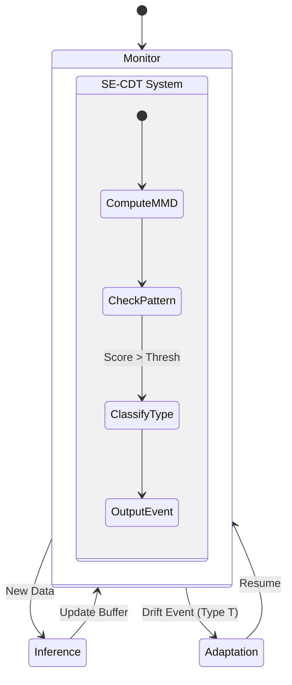

# Adaptive Learning System: Design & Analysis

## 1. Architectural Design (System-Level)

The system is defined as a **Closed-Loop Adaptive Learning System** processing a continuous data stream $S = \{(x_t, y_t)\}$.

### 1.1 Modules & Data Flow

1.  **Stream Interface (Input):**
    *   **Input:** Raw stream.
    *   **Output:** Batches/Windows $W_t$.
2.  **Inference Module:**
    *   **Input:** $x_t$, Current Model $M_t$.
    *   **Output:** Prediction $\hat{y}_t$, Error/Confidence.
3.  **Unified Detector-Classifier Module (SE-CDT):**
    *   **Input:** Stream Window $W_t$.
    *   **Internal Component 1 (Detection):**
        *   Algorithm: **ShapeDD-ADW (`shapedd_adw_mmd`)**.
        *   Computes MMD trace $\Sigma_t$ and triggers drift if score > $\theta$.
    *   **Internal Component 2 (Analysis):**
        *   Algorithm: **Algorithm 3.4 (Peak Analysis)**.
        *   Triggered automatically upon drift detection.
        *   Analyzes the internal MMD trace $\Sigma_t$.
    *   **Output:** Drift Event $E_t = \{IsDrift, Type, StartTime\}$.
4.  **Adaptation Manager (Controller):**
    *   **Input:** Drift Event $E_t$, Buffer Data $B_t$.
    *   **Logic:**
        *   **Sudden:** `Reset` $M_t$.
        *   **Recurrent:** `Retrieve` $M_{cache}$.
        *   **Gradual:** `Update` $M_t$.
    *   **Output:** New Model $M_{t+1}$.

### 1.2 State Machine (Pipeline Logic)

## 2. Architecture Analysis: Refactored SE-CDT

This design aligns with the CDT_MSW philosophy where the complexity is encapsulated:

*   **Old (Manual Integration):** The Evaluation Loop had to compute MMD, slice it, and pass it to `SE_CDT.classify()`.
*   **New (Encapsulated):** The Evaluation Loop just calls `se_cdt.process(window)`. `SE_CDT` internally manages the MMD computation (using `shapedd_adw_mmd`) and state tracking.

## 3. Consistency & Naming Analysis

### 3.1 Terminology Mapping

| Current Code | Proposed Thesis Name | Reasoning |
| :--- | :--- | :--- |
| `shapedd_adw_mmd` | **ShapeDD-ADW Engine** | The internal engine driving detection. |
| `SE_CDT` (Refactored) | **SE-CDT System** | The high-level component replacing CDT_MSW. |
| `evaluate_prequential` | **Prequential Evaluation Pipeline** | The integration harness. |

## 4. Implementation Strategy

*   **Refactor `experiments/backup/se_cdt.py`:**
    *   Add `monitor(window)` method.
    *   Inside `monitor()`: Call `shapedd_adw_mmd(window)`.
    *   If drift detected: Call `self.classify(mmd_trace)`.
    *   Return unified result.
*   **Update `evaluate_prequential.py`:**
    *   Simplify the loop to just use `se_cdt.monitor()`.

## 5. Gap Analysis for Paper

To publish this:
1.  **Architecture Validation:** The refactoring proves that SE-CDT is a standalone system, not just a collection of scripts.
2.  **Performance:** Verify that the "Encapsulated" version has negligible overhead compared to the "Manual" version.
